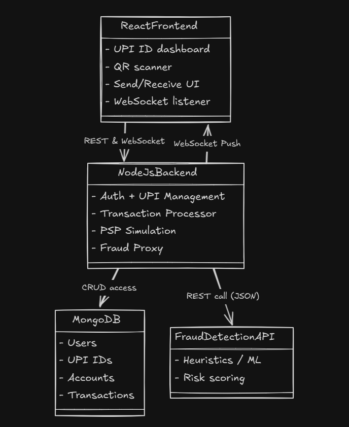

# System Architecture

## Diagram

## Backend

- Authentication
- UPI Management
- Transaction Processor
- PSP Simulation
- Fraud Proxy

## MongoDB (Document Stores)

- Users
- UPI IDs
- Accounts
- Transactions

## Fraud Detection API

- DL models
- Risk score

## Overall Architecture

